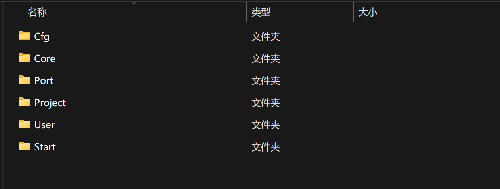
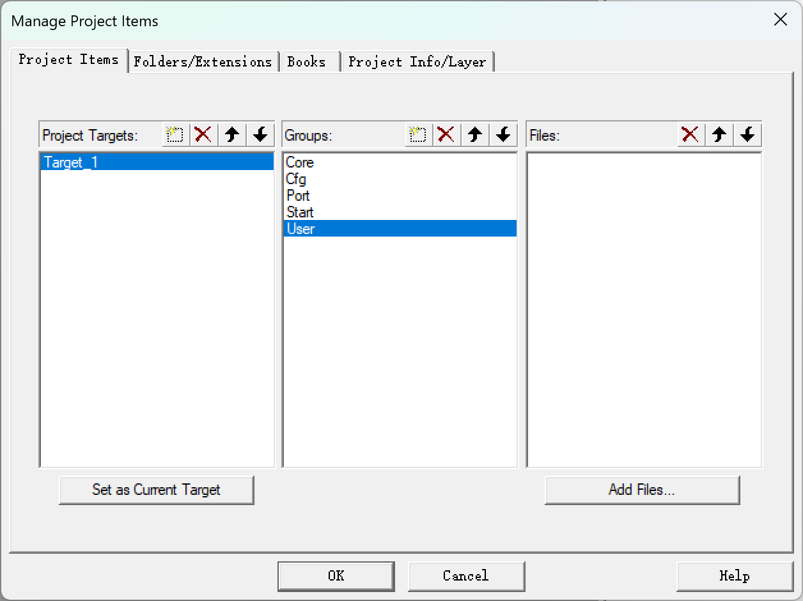
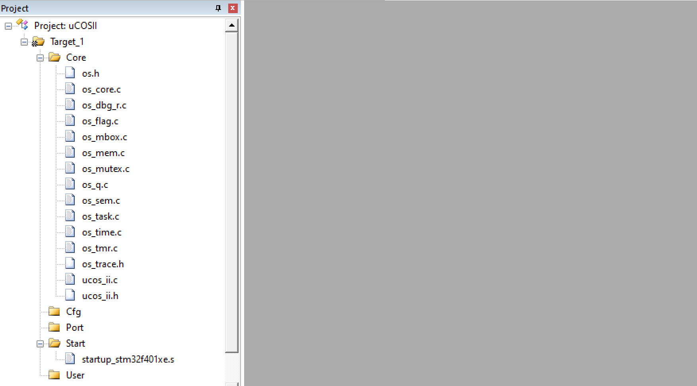
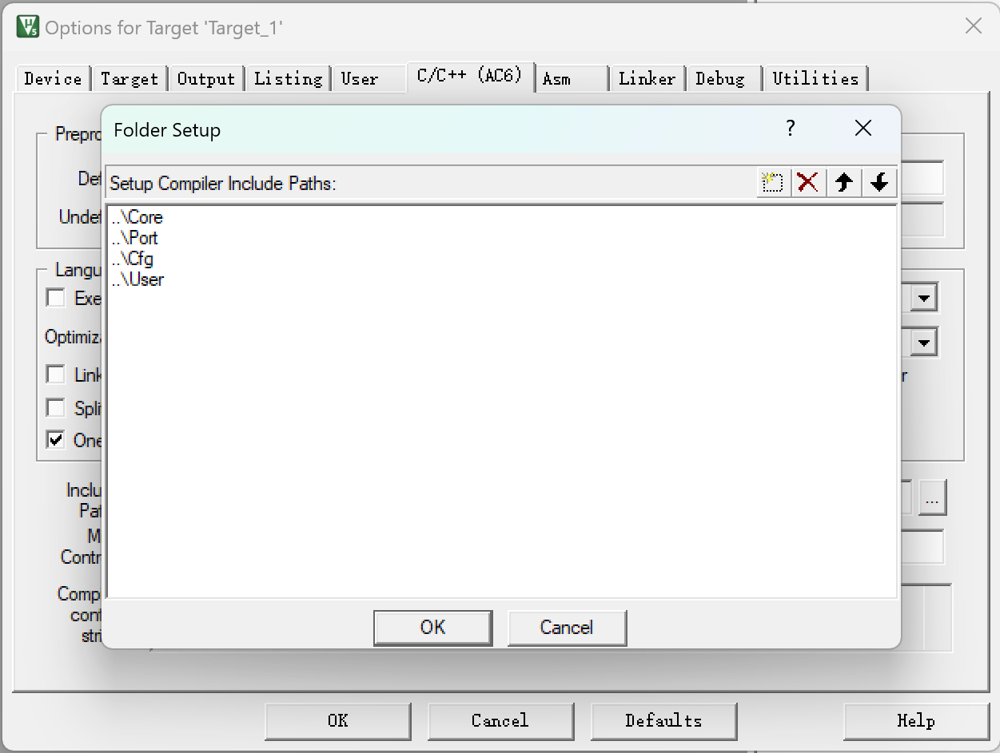
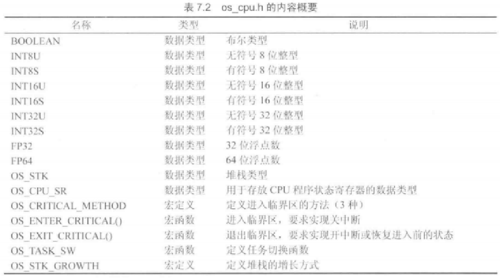
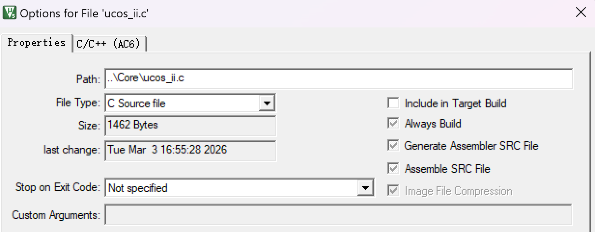
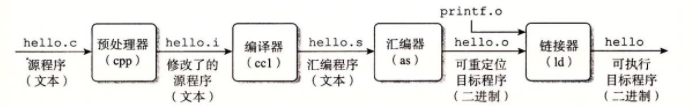
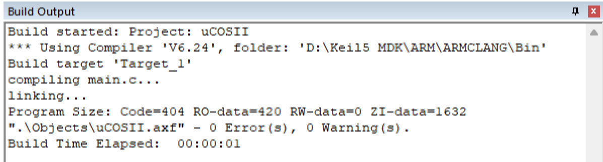

# 使用 Keil 重构 uC/OS II 新工程


#### 0. 需要思考的问题：
- uC/OS II 整体工程结构（开发工具无关、硬件无关）
- 新工程的配置
- 如何编译链接和调试 uC/OS II 的新工程文件
- 如何验证工程构建成功
- 创建自己的第一个任务
- 实现点灯，验证工程重构
---  

### 1. uC/OS II 整体工程结构 
#### ① Core层
> 内核的主体，用ANSI C编写，实现了任务管理、通信同步、内存管理、时间管理等核心逻辑，与处理器型号无关
- os_core.c：负责操作系统内核的初始化和核⼼功能的实现，包括任务调度器的初始化和空闲任务的创建。
- os_task.c：包含任务管理相关的函数，如任务的创建、删除和任务控制块（TCB）的操作。
- os_flag.c：实现事件标志组功能，用于任务间的同步和通信。
- os_mem.c：提供内存管理功能，包括内存块的分配和释放。
- os_tmr.c：实现软件定时器功能，允许在指定时间后执行特定操作。
- os_mutex.c：提供互斥信号量功能，用于保护共享资源，防⽌同时访问导致的数据不⼀致。
- os_sem.c：uC/OS II中的信号量（Semaphore）功能在任务间的同步和互斥上起着重要作用。这个文件实现了信号量的接口函数
- os_mbox.c: 邮箱（Mailbox）是uC/OS II用于任务间消息传递的机制之一。这个文件实现了邮箱功能的接口函数。
- os_q.c：队列（Queue）也是任务间通信常用的方式之一，这个文件实现了队列的接口函数。
- ucos_ii.c：这个源文件包含了uC/OS II内核的核⼼功能实现，如操作系统初始化、任务调度算法、时钟节拍处理、中断管理、任务创建与删除、事件标志组、信号量、互斥量、邮箱和队列等操作的代码。它是uC/OS II操作系统运行的基础，实现了多任务环境下的同步与通信机制。
- ucos_ii.h：这个头文件包含了uC/OS II内核中使用的各种数据结构的定义，如任务、事件、链表、信号量等，以及函数声明。

#### ② Port层
> Ports 文件夹中的文件包含了针对不同处理器平台的移植代码。每个处理器平台都有不同的硬件架构和操作系统接口，因此需要根据处理器的特点进⾏移植，以确保 uC/OS II 内核可以在特定处理器上正确地运⾏。
- os_cpu.h：定义与处理器架构相关的数据类型和宏，确保操作系统能够在特定的 CPU 上运⾏。
- os_cpu_a.asm：包含与处理器架构相关的汇编代码，如上下文切换和中断处理等底层操作。
- os_cpu_c.c：实现与处理器架构相关的 C 语言函数，如任务上下文初始化等。

#### ③ Cfg层
> 配置文件，决定任务、堆栈、功能
- os_cfg.h：用于配置操作系统的功能和特性，如任务数量、堆栈大小、是否启用某些功能等。
- app_cfg.h：包含应用程序所需的头文件，确保编译器能够找到所有必要的声明和定义。
---

### 2. 项目创建
#### ① 创建文件夹
新建总工程文件夹，并新建子文件夹**Core, Cfg, Port, Project, Start, User**

将uC/OS II相关文件导入Core中。

#### ② 导入项目
在Keil 5中新建项目并选择芯片型号。
在Target 1中新建group，并add existing files。



#### ③ 添加路径
添加相关头文件路径。打开Options，在C/C++和Asm里的**Include Path**中写入C程序和汇编文件的路径。


---

### 3. 报错处理
#### ① 缺少文件
uC/OS II采用了一种自上而下的包含机制，ucos_ii.h会尝试include用户自定义的配置。故需要一些配置文件才能编译：
app_cfg.h: 存放用户任务的优先级、堆栈大小、应用相关的宏定义等。
os_cfg.h: 决定内核功能，即是否启用信号量、邮箱、任务数限制等。
> ../Core/os_mutex.c(34): warning: In file included from...
../Core\ucos_ii.h(45): error: 'app_cfg.h' file not found
45 | #include <app_cfg.h>
    |          ^~~~~~~~~~~
1 error generated.

这些error信息提示我们缺少app_cfg.h文件。
**解决方式：在Cfg文件夹中建立一个空的app_cfg.h文件。**
同理添加os_cfg.h(Cfg)、os_cpu.h(Port)
*注意，存放这些.h的目录的Paths需要被include*

#### ② 缺少相应的数据类型的定义和函数的声明
这次出现了200+个error。绝大多数都类似于以下unknown type name类型的错误：
>  ../Core\ucos_ii.h(561): error: unknown type name 'OS_STK'
../Core\ucos_ii.h(600): error: unknown type name 'INT32U'
../Core\ucos_ii.h(601): error: unknown type name 'INT8U'
……

我们的os_cpu.h必须包含针对Cortex-M4的数据类型重定义。
> 为什么需要定义不同的变量类型INT8U,INT16U等？
对于signed int，unsigned int等原生类型时，其实际位数取决于处理器。⽐如在16位系统中int通常为16位，而在32/64位系统中，int通常为32位。这会导致移植不同平台时产生数据溢出等情况。
'INT8U'这些自定义数据类型，通过typedef明确定义数据类型的位数，保证了跨平台的一致性。

**解决方式：在os_cpu.h文件中添加相应的定义**
下表是对于μC/OS_II中数据类型的定义参考：

所以我们在os_cpu.h文件中定义相关数据类型：
```
//数据类型
typedef unsigned char BOOLEAN; // 定义布尔类型
typedef unsigned char INT8U; // 无符号8位整数
typedef signed char INT8S; // 有符号8位整数
typedef unsigned short INT16U; // 无符号16位整数
typedef signed short INT16S; // 有符号16位整数
typedef unsigned int INT32U; // 无符号32位整数
typedef signed int INT32S; // 有符号32位整数
typedef float FP32; // 单精度浮点数
typedef double FP64; // 双精度浮点数
typedef unsigned int OS_STK; // 每个栈条目为32位宽
typedef unsigned int OS_CPU_SR;// 定义CPU状态寄存器的大小（PSR=32位）
```

#### ③ os_cfg.h中缺少相应功能定义
又出现了200+ errors。提示在ucos_ii.h中缺少 OS_FLAG_EN、OS_MBOX_EN、OS_MEM_EN 等宏定义。

> ../Core\ucos_ii.h(1482): error: "OS_CFG.H, Missing OS_FLAG_EN: Enable (1) or Disable (0) code generation for Event Flags"
../Core\ucos_ii.h(1524): error: "OS_CFG.H, Missing OS_MBOX_EN: Enable (1) or Disable (0) code generation for MAILBOXES"
../Core\ucos_ii.h(1558): error: "OS_CFG.H, Missing OS_MEM_EN: Enable (1) or Disable (0) code generation for MEMORY MANAGER"
……

uC/OS II是一个高度可**裁剪**的实时操作系统。为了节省STM32的Flash和RAM资源，它要求用户通过os_cfg.h明确指定需要开启哪些功能。如果某项功能未开启，最终生成的二进制文件里完全没有对应的代码，从而节省了STM32有限的Flash空间。
os_cfg.h作为内核应用配置文件，可以看作内核的控制面板。它通过宏定义（#define）来决定哪些内核功能被编译进最终的固件中。
**解决方式：在os_cfg.h文件中添加相应的宏定义**
```
#ifndef OS_CFG_H
#define OS_CFG_H


                                       /* ---------------------- MISCELLANEOUS ----------------------- */
#define OS_APP_HOOKS_EN           1u   /* Application-defined hooks are called from the uC/OS-II hooks */
#define OS_ARG_CHK_EN             1u   /* Enable (1) or Disable (0) argument checking                  */
#define OS_CPU_HOOKS_EN           1u   /* uC/OS-II hooks are found in the processor port files         */

#define OS_DEBUG_EN               1u   /* Enable(1) debug variables                                    */

#define OS_EVENT_MULTI_EN         1u   /* Include code for OSEventPendMulti()                          */
#define OS_EVENT_NAME_EN          1u   /* Enable names for Sem, Mutex, Mbox and Q                      */

#define OS_LOWEST_PRIO           63u   /* Defines the lowest priority that can be assigned ...         */
                                       /* ... MUST NEVER be higher than 254!                           */

#define OS_MAX_EVENTS            10u   /* Max. number of event control blocks in your application      */
#define OS_MAX_FLAGS              5u   /* Max. number of Event Flag Groups    in your application      */
#define OS_MAX_MEM_PART           5u   /* Max. number of memory partitions                             */
#define OS_MAX_QS                 4u   /* Max. number of queue control blocks in your application      */
#define OS_MAX_TASKS             20u   /* Max. number of tasks in your application, MUST be >= 2       */

#define OS_SCHED_LOCK_EN          1u   /* Include code for OSSchedLock() and OSSchedUnlock()           */

#define OS_TICK_STEP_EN           1u   /* Enable tick stepping feature for uC/OS-View                  */
#define OS_TICKS_PER_SEC        100u   /* Set the number of ticks in one second                        */

#define OS_TLS_TBL_SIZE           0u   /* Size of Thread-Local Storage Table                           */


                                       /* --------------------- TASK STACK SIZE ---------------------- */
#define OS_TASK_TMR_STK_SIZE    128u   /* Timer      task stack size (# of OS_STK wide entries)        */
#define OS_TASK_STAT_STK_SIZE   128u   /* Statistics task stack size (# of OS_STK wide entries)        */
#define OS_TASK_IDLE_STK_SIZE   128u   /* Idle       task stack size (# of OS_STK wide entries)        */


                                       /* --------------------- TASK MANAGEMENT ---------------------- */
#define OS_TASK_CHANGE_PRIO_EN    1u   /*     Include code for OSTaskChangePrio()                      */
#define OS_TASK_CREATE_EN         1u   /*     Include code for OSTaskCreate()                          */
#define OS_TASK_CREATE_EXT_EN     1u   /*     Include code for OSTaskCreateExt()                       */
#define OS_TASK_DEL_EN            1u   /*     Include code for OSTaskDel()                             */
#define OS_TASK_NAME_EN           1u   /*     Enable task names                                        */
#define OS_TASK_PROFILE_EN        1u   /*     Include variables in OS_TCB for profiling                */
#define OS_TASK_QUERY_EN          1u   /*     Include code for OSTaskQuery()                           */
#define OS_TASK_REG_TBL_SIZE      1u   /*     Size of task variables array (#of INT32U entries)        */
#define OS_TASK_STAT_EN           1u   /*     Enable (1) or Disable(0) the statistics task             */
#define OS_TASK_STAT_STK_CHK_EN   1u   /*     Check task stacks from statistic task                    */
#define OS_TASK_SUSPEND_EN        1u   /*     Include code for OSTaskSuspend() and OSTaskResume()      */
#define OS_TASK_SW_HOOK_EN        1u   /*     Include code for OSTaskSwHook()                          */


                                       /* ----------------------- EVENT FLAGS ------------------------ */
#define OS_FLAG_EN                1u   /* Enable (1) or Disable (0) code generation for EVENT FLAGS    */
#define OS_FLAG_ACCEPT_EN         1u   /*     Include code for OSFlagAccept()                          */
#define OS_FLAG_DEL_EN            1u   /*     Include code for OSFlagDel()                             */
#define OS_FLAG_NAME_EN           1u   /*     Enable names for event flag group                        */
#define OS_FLAG_QUERY_EN          1u   /*     Include code for OSFlagQuery()                           */
#define OS_FLAG_WAIT_CLR_EN       1u   /* Include code for Wait on Clear EVENT FLAGS                   */
#define OS_FLAGS_NBITS           16u   /* Size in #bits of OS_FLAGS data type (8, 16 or 32)            */


                                       /* -------------------- MESSAGE MAILBOXES --------------------- */
#define OS_MBOX_EN                1u   /* Enable (1) or Disable (0) code generation for MAILBOXES      */
#define OS_MBOX_ACCEPT_EN         1u   /*     Include code for OSMboxAccept()                          */
#define OS_MBOX_DEL_EN            1u   /*     Include code for OSMboxDel()                             */
#define OS_MBOX_PEND_ABORT_EN     1u   /*     Include code for OSMboxPendAbort()                       */
#define OS_MBOX_POST_EN           1u   /*     Include code for OSMboxPost()                            */
#define OS_MBOX_POST_OPT_EN       1u   /*     Include code for OSMboxPostOpt()                         */
#define OS_MBOX_QUERY_EN          1u   /*     Include code for OSMboxQuery()                           */


                                       /* --------------------- MEMORY MANAGEMENT -------------------- */
#define OS_MEM_EN                 1u   /* Enable (1) or Disable (0) code generation for MEMORY MANAGER */
#define OS_MEM_NAME_EN            1u   /*     Enable memory partition names                            */
#define OS_MEM_QUERY_EN           1u   /*     Include code for OSMemQuery()                            */


                                       /* ---------------- MUTUAL EXCLUSION SEMAPHORES --------------- */
#define OS_MUTEX_EN               1u   /* Enable (1) or Disable (0) code generation for MUTEX          */
#define OS_MUTEX_ACCEPT_EN        1u   /*     Include code for OSMutexAccept()                         */
#define OS_MUTEX_DEL_EN           1u   /*     Include code for OSMutexDel()                            */
#define OS_MUTEX_QUERY_EN         1u   /*     Include code for OSMutexQuery()                          */


                                       /* ---------------------- MESSAGE QUEUES ---------------------- */
#define OS_Q_EN                   1u   /* Enable (1) or Disable (0) code generation for QUEUES         */
#define OS_Q_ACCEPT_EN            1u   /*     Include code for OSQAccept()                             */
#define OS_Q_DEL_EN               1u   /*     Include code for OSQDel()                                */
#define OS_Q_FLUSH_EN             1u   /*     Include code for OSQFlush()                              */
#define OS_Q_PEND_ABORT_EN        1u   /*     Include code for OSQPendAbort()                          */
#define OS_Q_POST_EN              1u   /*     Include code for OSQPost()                               */
#define OS_Q_POST_FRONT_EN        1u   /*     Include code for OSQPostFront()                          */
#define OS_Q_POST_OPT_EN          1u   /*     Include code for OSQPostOpt()                            */
#define OS_Q_QUERY_EN             1u   /*     Include code for OSQQuery()                              */


                                       /* ------------------------ SEMAPHORES ------------------------ */
#define OS_SEM_EN                 1u   /* Enable (1) or Disable (0) code generation for SEMAPHORES     */
#define OS_SEM_ACCEPT_EN          1u   /*    Include code for OSSemAccept()                            */
#define OS_SEM_DEL_EN             1u   /*    Include code for OSSemDel()                               */
#define OS_SEM_PEND_ABORT_EN      1u   /*    Include code for OSSemPendAbort()                         */
#define OS_SEM_QUERY_EN           1u   /*    Include code for OSSemQuery()                             */
#define OS_SEM_SET_EN             1u   /*    Include code for OSSemSet()                               */


                                       /* --------------------- TIME MANAGEMENT ---------------------- */
#define OS_TIME_DLY_HMSM_EN       1u   /*     Include code for OSTimeDlyHMSM()                         */
#define OS_TIME_DLY_RESUME_EN     1u   /*     Include code for OSTimeDlyResume()                       */
#define OS_TIME_GET_SET_EN        1u   /*     Include code for OSTimeGet() and OSTimeSet()             */
#define OS_TIME_TICK_HOOK_EN      1u   /*     Include code for OSTimeTickHook()                        */


                                       /* --------------------- TIMER MANAGEMENT --------------------- */
#define OS_TMR_EN                 0u   /* Enable (1) or Disable (0) code generation for TIMERS         */
#define OS_TMR_CFG_MAX           16u   /*     Maximum number of timers                                 */
#define OS_TMR_CFG_NAME_EN        1u   /*     Determine timer names                                    */
#define OS_TMR_CFG_WHEEL_SIZE     7u   /*     Size of timer wheel (#Spokes)                            */
#define OS_TMR_CFG_TICKS_PER_SEC 10u   /*     Rate at which timer management task runs (Hz)            */


                                       /* ---------------------- TRACE RECORDER ---------------------- */
#define OS_TRACE_EN               0u   /* Enable (1) or Disable (0) uC/OS-II Trace instrumentation     */
#define OS_TRACE_API_ENTER_EN     0u   /* Enable (1) or Disable (0) uC/OS-II Trace API enter instrum.  */
#define OS_TRACE_API_EXIT_EN      0u   /* Enable (1) or Disable (0) uC/OS-II Trace API exit  instrum.  */

#endif
```
在后续的学习中，我们可以在os_cfg.h调整相关功能的开启和禁用，或者调一些功能的范围和数值。注意部分参数的取值范围，若设定的参数不在范围内则会报错。

#### ④ os_cpu.h中缺少相关定义
> ../Core/os_flag.c(141): error: call to undeclared function 'OS_ENTER_CRITICAL'; ISO C99 and later do not support implicit function declarations [-Wimplicit-function-declaration]
../Core/os_flag.c(152): error: call to undeclared function 'OS_EXIT_CRITICAL'; ISO C99 and later do not support implicit function declarations [-Wimplicit-function-declaration]
../Core/os_flag.c(255): error: call to undeclared function 'OS_ENTER_CRITICAL'; ISO C99 and later do not support implicit function declarations [-Wimplicit-function-declaration]
……

出现了大量的undeclared function。
在uC/OS II中，这些并不是真正的函数，而是临界区宏。它们主要用于处理中断，作用是：
- OS_ENTER_CRITICAL()：关闭中断。防止在执行关键代码（如修改任务列表、切换堆栈）时被其他中断打断。梦回计组。
- OS_EXIT_CRITICAL()：恢复中断。

这两个宏的定义必须出现在os_cpu.h中。
现在的os_cpu.h还不完整，我们需要补全os_cpu.h，并添加一些必要的部分防止编译报错。
不过我们现阶段暂时还没有深入了解中断相关的内容，所以define部分可以用do { } while (0)这样的空实现暂时骗过编译器。
- OS_TASK_SW()是一个任务切换触发宏。对应的函数OSCtxSw()会在汇编文件中实现。
- 另外还需要加4个函数的声明。这四个函数会在os_cpu_a.s中以汇编形式实现。

**解决方式：在os_cpu.h中添加定义，补全os_cpu.h**
以下为主要部分
```
#define OS_ENTER_CRITICAL() do { } while (0)
#define OS_EXIT_CRITICAL()  do { } while (0)

#define  OS_TASK_SW()         OSCtxSw()

void       OSCtxSw                (void);
void       OSIntCtxSw             (void);
void       OSStartHighRdy         (void);
void       OS_CPU_SysTickInit     (void);
```

#### ⑤ 缺少启动文件
> .\Objects\uCOSII.sct(7): error: L6236E: No section matches selector - no section to be FIRST/LAST.
Not enough information to list image symbols.
Not enough information to list load addresses in the image map.

这是在工程里找不到中断向量表（Vector Table），找不到执行入口等。在STM32的启动流程中，链接器必须把中断向量表放在Flash的最开头（FIRST），但现在它找不到了。这些东西都在startup_stm32f401xe.s中，所以解决方法也很简单。
**解决方式：添加启动文件startup_stm32f401xe.s**
在Start下导入我们之前接触过的startup_stm32f401xe.s。这个文件定义了堆栈指针和中断向量表。注意最好包含一下路径。

#### ⑥ 链接时重复定义
> .\Objects\uCOSII.axf: Error: L6200E: Symbol OSEventNameGet multiply defined (by ucos_ii.o and os_core.o).
.\Objects\uCOSII.axf: Error: L6200E: Symbol OSTaskQuery multiply defined (by ucos_ii.o and os_task.o).
.\Objects\uCOSII.axf: Error: L6200E: Symbol OSUnMapTbl multiply defined (by ucos_ii.o and os_core.o).
.\Objects\uCOSII.axf: Error: L6200E: Symbol OSTimeDlyHMSM multiply defined (by ucos_ii.o and os_time.o).
.\Objects\uCOSII.axf: Error: L6200E: Symbol OS_StrLen multiply defined (by ucos_ii.o and os_core.o).
……133 errors

出现了两个.o文件中大量的OSEventNameGet这类内核函数被multiply defined（重复定义）。
ucos_ii.o和os_xxx.o这两个.o文件都是编译器编译同名.c文件生成的对象（object）文件。
> 为什么会出现重复定义？
出现重复定义是因为uC/OS II提供了一种特殊的编译模式。为了让编译器进行更好的全局优化，官方提供了一个 ucos_ii.c 文件。这个文件里面全是 #include "os_xxx.c"等语句。但是我们把 os_core.c, os_task.c, os_time.c等文件一个一个添加到Keil的工程列表里，编译器就会编译两遍这些函数，导致链接时发生冲突。所以解决方法也很明确了。

**解决方式：关闭ucos_ii.c或os_xxx.c的编译包含**
以关闭ucos_ii.c为例，我们只需要右键core，点击options，关闭此部分的编译包含（Include in Target Build）。

> 拓展一下：为什么链接阶段报错？
> 我们可以简单了解一下源程序处理的流程：
> 
> - 预处理器主要将项目代码进行处理，删除注释、#include、展开宏定义等；uC/OS II还会在这一阶段进行内核裁剪。
> - 编译器则是我们熟悉的词法分析、语法分析、语义分析等过程得到.s文件；
> - 经过汇编器处理后汇编得到.o文件;
> - 之后**链接器会检查所有目标文件和库文件中的符号定义和引用**；
> - 最终生成可执行程序。
> 深入了解可以参考[这里](https://zhuanlan.zhihu.com/p/476697014)

#### ⑦ 缺失Hook钩子函数
> .\Objects\uCOSII.axf: Error: L6218E: Undefined symbol OSInitHookBegin (referred from os_core.o).
.\Objects\uCOSII.axf: Error: L6218E: Undefined symbol OSInitHookEnd (referred from os_core.o).
.\Objects\uCOSII.axf: Error: L6218E: Undefined symbol OSTimeTickHook (referred from os_core.o).
.\Objects\uCOSII.axf: Error: L6218E: Undefined symbol OSTaskIdleHook (referred from os_core.o).
……

可以看到缺失了一大堆带Hook的函数。
> 什么是Hook钩子函数？
钩子函数是uC/OS-II内核在特定操作（如任务创建、删除、切换等）前后调用的空函数（默认为空实现）。开发者通过重写这些函数，可以在不修改内核源码的情况下扩展功能。常见用途包括：
调试与监控：记录任务创建/删除时间、堆栈使用情况等。
资源管理：在任务创建时初始化自定义数据结构或外设。
性能分析：统计任务执行时间或上下文切换次数。
安全检查：验证任务参数的合法性。
以OSTaskCreateHook为例，它在任务创建后被调用，允许开发者在任务首次运行前执行自定义逻辑。
简单来讲就是获取操作系统的相关状态。

**解决方式：在os_cpu_c.c中补充缺少的Hook函数等**
我们需要在Port里新建一个os_cpu_c.c，在其中补充缺少的函数实现，目前我们不需要补全具体的函数实现细节，只需要写⼀个空定义来骗过编译器。
在os_cpu_c.c文件中，我们定义空的系统初始化函数、钩子函数、cpu异常栈基地址和这是内核可用的优先级边界。
```
#include "os_cpu.h"
// 系统初始化函数，通常用于设置硬件相关的设置
void SystemInit(){}
// 定义空的钩子函数
void OSInitHookBegin(){}
void OSInitHookEnd(){}
void OSTCBInitHook(){}
void OSTaskCreateHook(){}
void OSTaskIdleHook(){}
void OSTaskReturnHook(){}
void OSTaskSwHook(){}
void OSTimeTickHook(){}
void OSTaskStatHook(){}
void OSTaskDelHook(){}

// 任务堆栈初始化函数，为新任务分配堆栈空间
OS_STK *OSTaskStkInit(void (*task)(void *p_arg), void *p_arg, OS_STK *ptos,
INT16U opt){
return ptos;
}
// 定义一个空的CPU异常栈基地址
OS_STK *OS_CPU_ExceptStkBase;          // 全局变量定义
// 设置内核可用的优先级边界
void OS_KA_BASEPRI_Boundary(){}

```

#### ⑧ 缺失汇编部分
> .\Objects\uCOSII.axf: Error: L6218E: Undefined symbol OS_CPU_SR_Save (referred from os_core.o).
.\Objects\uCOSII.axf: Error: L6218E: Undefined symbol OS_CPU_SR_Restore (referred from os_core.o).
.\Objects\uCOSII.axf: Error: L6218E: Undefined symbol OSCtxSw (referred from os_core.o).
……

OS_CPU_SR_Save, OS_CPU_SR_Restore, OSCtxSw, OSIntCtxSw, OSStartHighRdy等等函数缺失。这些函数是 uC/OS II与STM32F401硬件直接打交道的接口，它们只能用汇编实现。
> 为什么要使用汇编？
在os_cpu_a.s文件中，实现的是与处理器相关的函数,这一部分的函数涉及CPU特权寄存器的访问、寄存器状态的保存与恢复，以及任务上下文切换。
这些操作需要对CPU体系结构和指令集进行精确控制，而高级语言（如 C）无法提供直接读写特定硬件寄存器（如中断寄存器PRIMASK、堆栈PSP、任务控制块TCB）的机制，也难以确保任务切换的精确性和高效性。

**解决方式：加入汇编函数确定相关逻辑**
```
.syntax unified
    .cpu cortex-m4
    .fpu softvfp
    .thumb

    .global OSStartHighRdy
    .global OSCtxSw
    .global OSIntCtxSw

    .extern OSTaskSwHook
    .extern OSRunning
    .extern OSTCBHighRdy

    .section .text
    .align 2


    .thumb_func
OSStartHighRdy:
    ldr     r0, =OSTCBHighRdy
    ldr     r1, [r0]        
    ldr     r2, [r1]        

    ldmia   r2!, {r4-r11}

    msr     psp, r2

    movs    r0, #2
    msr     control, r0
    isb                    

    cpsie   i
    pop     {r0-r3, r12, lr}
    pop     {r1, r2}     
    
    bx      r1

    .thumb_func
OSCtxSw:
    BX      LR

    .thumb_func
OSIntCtxSw:
    BX      LR
```
#### ⑨ 缺少main函数
> .\Objects\uCOSII.axf: Error: L6218E: Undefined symbol main (referred from __rtentry2.o).

无需多言。距离胜利只有一步之遥了。
**解决方式：添加main函数**
随便写一个main
```
#include "ucos_ii.h"
int main()
{
    OSTimeDly(1000 * 2);
	while(1) {}
}

```


0 Error(s), 0 Warning(s). 构建成功。
